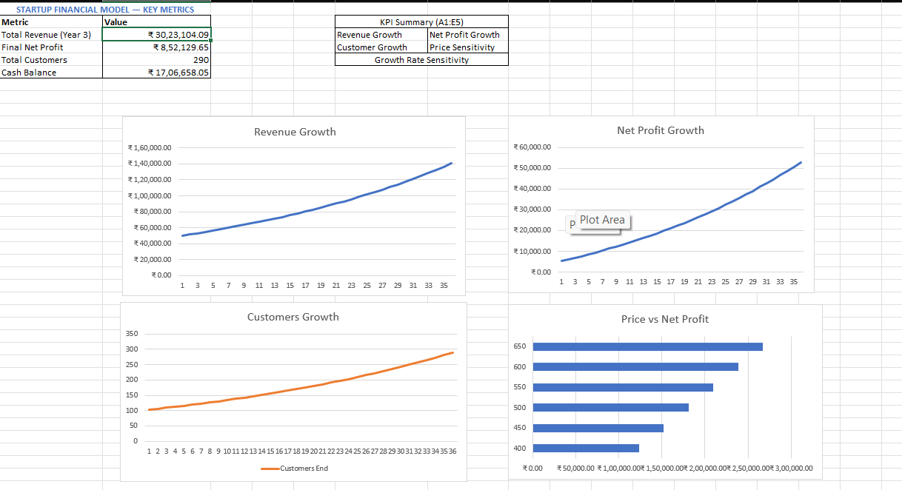
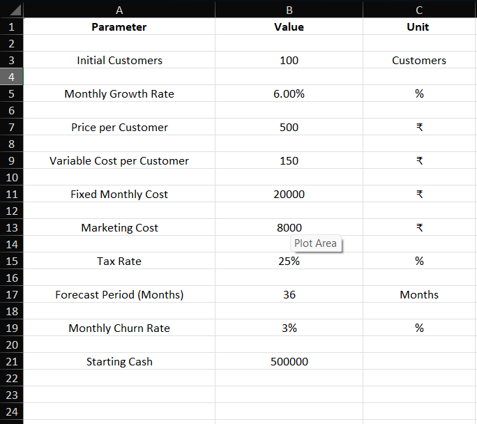

# 📊 Startup Financial Planning Model   

A comprehensive 36-month financial planning model built in Excel for early-stage startups. Models customer growth with churn, revenue projections, cost structure, unit economics, and cash flow — all driven from a single assumptions sheet.

---

## 📁 File Structure

| Sheet                  | Description                                        |
| ---------------------- | -------------------------------------------------- |
| `Assumptions`          | Central input sheet — all key parameters live here |
| `Customer_Model`       | Monthly customer growth with churn logic           |
| `Revenue_Model`        | Revenue projections linked to Customer_Model       |
| `Cost_Model`           | Variable, fixed, and marketing costs               |
| `Model_Calculations`   | Gross profit, contribution margin, break-even      |
| `Unit_Economics`       | CAC, LTV, and LTV/CAC ratio                        |
| `Profit_Loss`          | Monthly P&L with tax                               |
| `Cash_Flow`            | Cumulative cash balance from starting cash         |
| `Sensitivity_Analysis` | Net profit sensitivity to price and growth rate    |
| `Dashboard`            | Key metrics summary                                |

---

## ⚙️ Key Assumptions

All inputs are centralised in the **Assumptions** sheet. Change any value there and the entire model updates automatically.

| Parameter                  | Default Value |
| -------------------------- | ------------- |
| Initial Customers          | 100           |
| Monthly Growth Rate        | 6%            |
| Monthly Churn Rate         | 3%            |
| Price per Customer         | ₹500          |
| Variable Cost per Customer | ₹150          |
| Fixed Monthly Cost         | ₹20,000       |
| Marketing Cost (monthly)   | ₹8,000        |
| Tax Rate                   | 25%           |
| Starting Cash              | ₹5,00,000     |
| Forecast Period            | 36 Months     |

---

## 📐 Model Logic

### Customer Growth

```
Customers End = Customers Start + New Customers − Churned Customers
New Customers  = Customers Start × Monthly Growth Rate
Churned        = Customers Start × Monthly Churn Rate
```

### Revenue

```
Revenue = Customers × Price per Customer
```

### Costs

```
Variable Cost = Customers × Variable Cost per Customer
Total Cost    = Variable Cost + Fixed Cost + Marketing Cost
```

### Unit Economics

```
CAC           = Monthly Marketing Cost / Avg New Customers per Month
LTV           = Price per Customer / Monthly Churn Rate
LTV/CAC Ratio = LTV / CAC
```

### Break-Even

```
Contribution Margin  = Price − Variable Cost per Customer
Break-Even Customers = (Fixed Cost + Marketing Cost) / Contribution Margin
```

### Cash Flow

```
Net Cash Flow  = Revenue − Total Cost
Cash Balance   = Prior Month Balance + Net Cash Flow
```

---

## 📈 Key Outputs (Base Case)

| Metric                    | Value      |
| ------------------------- | ---------- |
| Total Revenue (36 months) | ₹30,23,104 |
| Customers at Month 36     | ~281       |
| CAC                       | ~₹727      |
| LTV                       | ₹16,667    |
| LTV/CAC Ratio             | ~22.9x     |
| Break-Even Customers      | ~57        |

---

## 📸 Preview




## 🔧 How to Use

1. **Open** `Startup_Financial_Planning_Model.xlsx` in Microsoft Excel
2. **Go to the Assumptions sheet** and update inputs for your business
3. All other sheets will **recalculate automatically**
4. Use the **Sensitivity Analysis** sheet to stress-test price and growth rate scenarios
5. Check the **Dashboard** for a quick summary of key metrics

---

## ⚠️ Known Limitations

- Marketing cost is fixed monthly — does not scale with customer growth
- Fixed costs do not include hiring or infrastructure scaling
- Model assumes immediate revenue collection (no payment delay)
- Tax is applied monthly rather than annually

---

## 🛠️ Built With

- Microsoft Excel
- All formulas use cell references — no hardcoded values in calculations
- Single source of truth: all assumptions flow from the `Assumptions` sheet

---

## 📄 License

This project is open for personal and commercial use. Attribution appreciated but not required.
